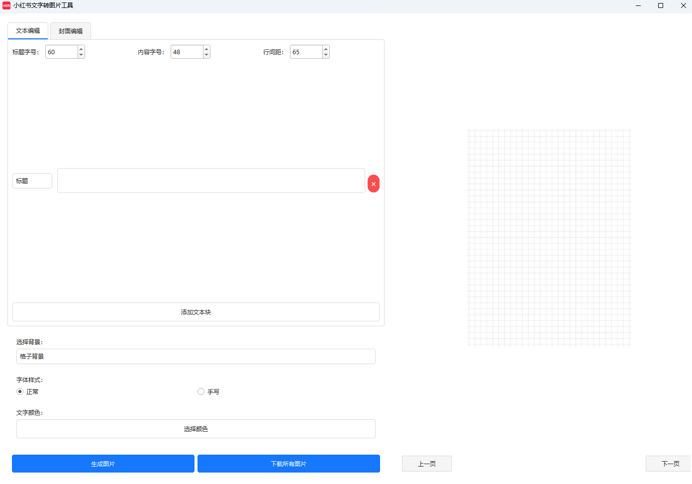

# 小红书文字转图片工具

一个简单易用的工具，用于将文本内容转换成小红书风格的图片。

## 主要功能

### 1. 文本编辑
- 支持标题和正文两种文本类型
- 可自由调整字体大小
- 支持调整行间距
- 支持多文本块编辑和排序

### 2. 封面编辑
- 支持文字样式编辑
  - 可调整字体大小
  - 支持字体加粗
  - 可设置字间距和行间距
- 丰富的装饰效果
  - 支持添加椭圆强调
  - 支持添加下划线
  - 可自定义装饰颜色
  - 可调整装饰位置和大小

### 3. 样式设置
- 多种背景模板选择
  - 网格背景
  - 小红书风格背景
  - 纯色背景
  - 空白背景
- 字体样式选择
  - 支持正常字体
  - 支持手写风格字体

### 4. 图片生成
- 自动分页功能
- 保持 3:4 的标准小红书图片比例
- 支持批量导出
- 自动创建以日期-标题命名的文件夹

### 5. 预览功能
- 实时预览生成效果
- 支持多页预览
- 可通过导航按钮切换预览页面

## 使用说明

1. 文本编辑模式：
   - 点击"添加文本块"添加新的文本内容
   - 选择文本类型（标题/内容）
   - 调整字体大小和行间距
   - 点击"生成图片"预览效果

2. 封面编辑模式：
   - 输入文本内容
   - 选择需要强调的文字
   - 使用工具栏添加装饰效果
   - 调整装饰的样式和位置

3. 导出图片：
   - 点击"下载所有图片"
   - 选择保存位置
   - 程序会自动创建文件夹并保存所有图片

## 注意事项

- 建议使用推荐的字体大小以获得最佳效果
- 过长的文本会自动分页处理
- 建议在导出前先预览效果 